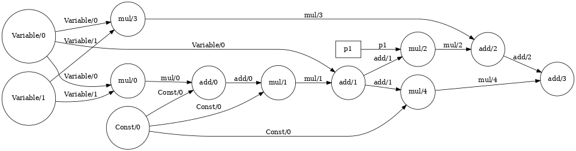

# cookie
_A see-through automatic differentiation library._

This library is my effort to understand reverse automatic differentiation, most famously used in TensorFlow. I have used nothing but numpy and written everything from scratch (see credits). The end goal of this exercise is to understand autodiff and write usable code with reasonable performance.

## Credits

The initial version of this library is almost completely based on [Jonathan Kernes's](https://www.linkedin.com/in/jonathan-kernes/) amazing blog [Build Your Own Automatic Differentiation Program](https://towardsdatascience.com/build-your-own-automatic-differentiation-program-6ecd585eec2a). Do check out his blog!

## Contributing

Feel free to open a PR for small changes. For medium to large sized changes, consider opening an issue first to discuss regarding the same.